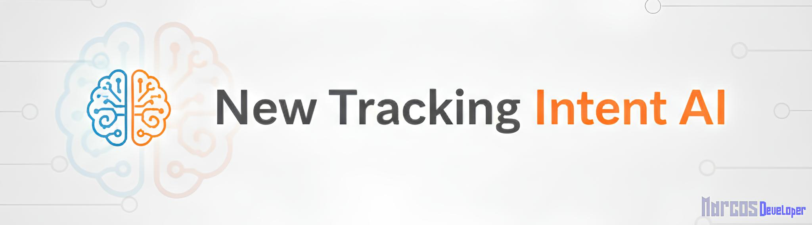

# 🤖 New Tracking - Intent AI

> New Tracking - Intent AI é um microsserviço especializado em traduzir linguagem natural para filtros estruturados. Construído com Python, FastAPI e LangChain, este sistema atua como o "cérebro da interpretação" para a plataforma New Tracking. Ele recebe perguntas de usuários em português, as normaliza e converte em um objeto JSON preciso, que é então consumido pelo NT API backend para consultar uma procedure no banco de dados (SP_TK_NOTAS_AI_HOM). Com uma arquitetura de duas cadeias de IA, o serviço lida com sinônimos, ambiguidades e lógicas de data complexas, permitindo uma interação conversacional poderosa com os dados logísticos.

# 🗂️ Índice
- [🤖 New Tracking - Intent AI](#-new-tracking---intent-ai)
- [🗂️ Índice](#️-índice)
- [🛠️ Tecnologias Usadas](#️-tecnologias-usadas)
  - [**Geral**](#geral)
  - [**Interface de Teste e Demonstração (Streamlit)**](#interface-de-teste-e-demonstração-streamlit)
- [🌳 Estrutura do Projeto](#-estrutura-do-projeto)
- [🔄 Updates](#-updates)
  - [Nota sobre Chain of Thought (CoT) - Desativado](#nota-sobre-chain-of-thought-cot---desativado)
  - [Próximas Implementações](#próximas-implementações)
- [🧠 Funcionamento](#-funcionamento)
  - [`app/main.py`](#appmainpy)
  - [`app/chains/master_chain.py`](#appchainsmaster_chainpy)
  - [`app/prompts/filter_prompts.py`](#apppromptsfilter_promptspy)
- [🧩 Outros Módulos e Ferramentas de Suporte](#-outros-módulos-e-ferramentas-de-suporte)
- [🌐 Endpoints](#-endpoints)
  - [**1. Endpoint de Produção**](#1-endpoint-de-produção)
    - [**Endpoint:** `POST /parse-query`](#endpoint-post-parse-query)
  - [**2. Endpoint de Debug**](#2-endpoint-de-debug)
    - [**Endpoint:** `POST /debug-query`](#endpoint-post-debug-query)
- [💾 Componente de Banco de Dados](#-componente-de-banco-de-dados)
  - [Integração com Stored Procedure (Ex: `SP_TK_NOTAS_AI_HOM`)](#integração-com-stored-procedure-ex-sp_tk_notas_ai_hom)
- [🚀 Instalação e Configuração Local](#-instalação-e-configuração-local)
  - [Pré-requisitos](#pré-requisitos)
  - [Passos de Instalação](#passos-de-instalação)
  - [Executando a Aplicação](#executando-a-aplicação)
  - [Ferramentas de Teste e Desenvolvimento](#ferramentas-de-teste-e-desenvolvimento)
- [🤝 Contato](#-contato)
  - [Dúvidas, Bugs ou Sugestões?](#dúvidas-bugs-ou-sugestões)
  - [Vamos nos Conectar!](#vamos-nos-conectar)

---

# 🛠️ Tecnologias Usadas

## **Geral**
- [Python](https://www.python.org/) (**3.12**)
- [FastAPI](https://fastapi.tiangolo.com/)
- [LangChain](https://www.langchain.com/)
- [Pydantic](https://docs.pydantic.dev/latest/)
- [Git](https://git-scm.com/)
- [Modelo LLM - llama-3.1-8b-instant (GROQ)](https://groq.com/)
- [Modelo LLM - Gemini-2.5-flash](https://ai.google.dev/gemini-api/docs/models)

---

## **Interface de Teste e Demonstração (Streamlit)**

> [!IMPORTANT]
> Este projeto é um microsserviço de backend, projetado para ser consumido por outra API. Como tal, não inclui uma interface de frontend para o usuário final.

Para fins de desenvolvimento, depuração e demonstração, o repositório contém uma interface de teste interativa (`test_ui.py`) desenvolvida com **Streamlit**. Esta ferramenta é essencial para entender o comportamento da IA e permite ao desenvolvedor:

-   **Testar Queries Individuais:** Enviar perguntas em linguagem natural de forma rápida, sem a necessidade de usar um cliente de API como o Postman.
-   **Visualizar o Fluxo de IA:** Observar em tempo real a transformação dos dados em cada etapa da cadeia:
    1.  A query original do usuário.
    2.  A versão normalizada pela cadeia `Enhancer`.
    3.  O objeto JSON final extraído pela cadeia `Parser`.
-   **Depurar e Validar:** Validar instantaneamente o resultado das alterações nos prompts, tornando o processo de "prompt engineering" muito mais eficiente.

> [!NOTE]
> Esta interface é uma ferramenta exclusiva para desenvolvimento e não faz parte do serviço principal (`main.py`) exposto pelo Uvicorn/FastAPI.

---

# 🌳 Estrutura do Projeto

```
├── 📁 app
│   ├── 📁 chains
│   │   ├── 🐍 __init__.py
│   │   └── 🐍 master_chain.py
│   ├── 📁 core
│   │   ├── 🐍 __init__.py
│   │   └── 🐍 llm.py
│   ├── 📁 prompts
│   │   ├── 🐍 __init__.py
│   │   └── 🐍 filter_prompts.py
│   ├── 🐍 __init__.py
│   └── 🐍 main.py
├── 📁 logs/
├── 📁 scripts
│   ├── 🐍 debug_runner.py
│   └── 🐍 test_ui.py
├── 📁 sql
│   ├── 📄 SCRIPT_TESTE_AI_HOM.sql
│   ├── 📄 SP_DOC.txt
│   └── 📄 SP_TK_NOTAS_AI_HOM.sql
├── 📁 tests_cases
│   ├── 📄 testes.txt
│   └── 📄 testes_pontuais.txt
├── 📁 venvntia
├── 🔒 .env
├── 🔒 .env.example
├── 📄 .gitignore
├── 📝 README.md
└── 📄 requirements.txt
```


# 🔄 Updates

> [!NOTE]
> Versão 1

| Versão | Data       | Mudanças principais               |
|--------|------------|-----------------------------------|
| 1.0    | 22/10/2025 | MVP funcional


## Nota sobre Chain of Thought (CoT) - Desativado 

Durante o desenvolvimento e otimização da precisão da IA (especialmente na Cadeia de Parsing), a técnica de **Chain of Thought (CoT)** foi implementada e testada.

**O que é CoT?**

Chain of Thought é uma técnica de engenharia de prompts onde instruímos o Modelo de Linguagem (LLM) a "pensar passo a passo" antes de fornecer a resposta final. Em vez de pedir diretamente o JSON, o prompt pedia ao LLM para primeiro:
1.  Analisar o texto da consulta.
2.  Listar as entidades extraídas.
3.  Verificar as regras de negócio aplicáveis.
4.  *Só então* gerar o "JSON FINAL".

**Motivação para Usar (Benefícios):**

A principal motivação foi **aumentar a precisão da extração em consultas complexas**. Forçar o LLM a articular seu raciocínio intermediário demonstrou melhorar significativamente a aderência às regras de negócio complexas, como:
* A precedência do `StatusAnaliseData` sobre o `TipoData` 
* A correta aplicação de regras de coexistência entre `SituacaoNF` e `StatusAnaliseData`.
* A redução geral de erros onde o LLM poderia "esquecer" um filtro ao tentar formatar o JSON diretamente.

**Como poderia ser Implementado:**

1.  **Prompt (`filter_prompts.py`):** Adicionamos a seção "Pense passo a passo..." ao final do `JSON_PARSER_PROMPT`.
    ```python
    # Exemplo do bloco CoT adicionado ao prompt:
    """
    Pense passo a passo antes de gerar o JSON final:
    1.  **Análise do Texto:** (...)
    2.  **Extração de Entidades:** (...)
    3.  **Verificação de Regras:** (...)

    JSON FINAL:
    """
    ```
2.  **Orquestração (`master_chain.py`):** Como a saída do LLM agora continha o "pensamento" + "JSON FINAL:", foi necessário adicionar um passo extra na `json_parser_chain` usando `RunnableLambda` e uma função auxiliar (`_extract_json_from_output`) para isolar apenas o bloco JSON antes de passá-lo ao `OutputFixingParser`.

**Motivo da Desativação:**

Apesar da melhoria na precisão, o CoT introduziu um **custo computacional significativamente maior** por chamada à API do LLM (Groq, usando `llama-3.1-8b-instant` no *free tier*):
* **Latência Aumentada:** O tempo de resposta por query aumentou consideravelmente, pois o LLM precisava gerar mais texto (o raciocínio).
* **Problemas com Rate Limiting:** A API da Groq (no nível gratuito) possui limites de taxa agressivos (aproximadamente 1 chamada complexa/minuto). O CoT tornava as chamadas "caras", ativando o *throttling* (fila de espera) da API e causando timeouts no nosso script de teste (`debug_runner.py`), mesmo com timeouts de cliente aumentados (120s).

**Decisão Atual:**

Para garantir a **estabilidade dos testes**, e manter uma **performance aceitável** dentro das limitações do *free tier* da Groq, o Chain of Thought foi **desativado**. A precisão resultante (sem CoT, mas com prompts e exemplos refinados) foi considerada **muito boa (~97-100%)** e aceitável para o contexto atual da aplicação (uso interno). A estratégia de rodar testes em lotes com pausas longas (`debug_runner.py`) provou ser eficaz para evitar novos banimentos.

**Considerações Futuras:**

* Se a aplicação migrar para um plano pago da API LLM com limites de taxa mais altos.
* Se testes futuros revelarem uma queda inaceitável na precisão para casos de uso críticos.
* Nesses cenários, a **reativação do CoT** pode ser reconsiderada como uma forma de maximizar a robustez da interpretação.

---
## Próximas Implementações
- [ ] Monitorar a frequência de erros 400 (JSON nulo) em produção para avaliar a necessidade futura de um Gatekeeper Prompt.
- [ ] Expandir o roteiro de testes com mais casos de borda e combinações complexas.
---

# 🧠 Funcionamento

Nesta seção, apresentamos uma visão detalhada de como cada parte do New Tracking - Intent AI opera. Aqui você encontrará uma explicação clara de como os módulos interagem entre si, como os dados fluem da pergunta do usuário até a geração do JSON final, e como a inteligência artificial é utilizada para normalizar e extrair informações complexas.

O objetivo é fornecer ao leitor uma compreensão completa do funcionamento interno do sistema, permitindo não apenas integrá-lo, mas também entender, manter e expandir seu código com facilidade.

> [!TIP]
> **Explore o código-fonte!** Cada arquivo de código mencionado abaixo foi documentado com um cabeçalho descritivo que detalha sua arquitetura, o fluxo de dados (entradas e saídas) e a responsabilidade de cada função. É um excelente complemento a esta documentação de alto nível.

---

## [`app/main.py`](./app/main.py)

> Este arquivo configura e expõe a API FastAPI, gerenciando o ciclo de vida e as requisições.

1. **Inicialização:** Carrega as variáveis de ambiente e, através dos eventos de ciclo de vida (startup/shutdown), gerencia o carregamento e o encerramento da aplicação.

2. **Logging:** Implementa um sistema de log robusto que escreve para o console e para um arquivo com rotação (logs/nt_ai_service.log), garantindo a observabilidade do serviço.

3. **Carregamento Otimizado:** Invoca a criação das cadeias de IA uma única vez durante o evento de startup, uma otimização de performance crucial que evita recarregar os modelos a cada requisição.

4.  **Endpoints Assíncronos:** Define `/parse-query` e `/debug-query`. Ambos agora incluem:
    * Validação semântica do JSON gerado pela IA usando Pydantic (`ParsedFilters`), retornando erro 500 se inválido.
    * Verificação se o JSON validado é totalmente nulo, retornando erro 400 se for o caso.
    * Logging do tempo total de processamento da requisição.

---

## [`app/chains/master_chain.py`](./app/chains/master_chain.py)

> Este módulo é o coração da lógica de IA, responsável por montar e conectar as diferentes etapas do processo de interpretação.

**Arquitetura e Princípio de Design:**

A arquitetura segue o princípio de "Separação de Responsabilidades", operando como uma linha de montagem com as seguintes etapas:

1. **Cálculo de Datas em Tempo de Execução:**

    - **Responsabilidade:** Garantir que a IA sempre trabalhe com o contexto de tempo correto.

    - **Ação:** A cada requisição, a função _get_current_dates calcula dinamicamente todos os períodos relevantes (hoje, ontem, semana de calendário, mês de calendário, etc.) e os injeta no fluxo de dados.

2. **O Tradutor (query_enhancer_chain):**

    **- Responsabilidade:** Normalizar a pergunta do usuário de forma segura.

    **- Ação:** Recebe a pergunta bruta e a traduz para os termos de negócio, expandindo abreviações (ex: "nf" -> "nota fiscal") sem alterar a intenção original.

3. **O Especialista em Extração (json_parser_chain):**

    - **Responsabilidade:** Converter a pergunta já normalizada em um objeto JSON estruturado.

    - **Ação:** Recebe a pergunta clara e os dados de tempo e, com base em regras e exemplos, extrai todas as entidades (status, locais, ordenação) para o formato JSON final.

4. **Resiliência com OutputFixingParser:**

    - **esponsabilidade:** Garantir que a saída seja sempre um JSON sintaticamente válido.

    - **Ação:** Se o LLM gerar um JSON com erro de sintaxe, esta ferramenta automaticamente solicita ao LLM que corrija seu próprio erro antes de retornar o resultado

**Funcionalidades Adicionais:**
* **Logging de Performance:** Inclui lógica para registrar o tempo gasto em cada chamada principal ao LLM (Enhancer e Parser).
* **Cadeias `master` e `debug`:** Define ambas as cadeias, sendo que a `debug` expõe resultados intermediários.

## [`app/prompts/filter_prompts.py`](.app/prompts/filter_prompts.py)

> Este arquivo centraliza todas as instruções que definem o comportamento da IA. É aqui que a "personalidade" e as "habilidades" do sistema são moldadas.

**Componentes Principais:**

1. **QUERY_ENHANCER_PROMPT (O Tradutor):**

    - Contém as "Regras de Ouro" que proíbem a IA de adicionar ou remover informações, garantindo a preservação da intenção do usuário.

    - Define um dicionário de mapeamento de sinônimos (ex: "rodando", "viajando" -> "em trânsito") e abreviações.

2. **JSON_PARSER_PROMPT (O Especialista em Extração):**

    - Define o "schema" do JSON de saída, listando todas as entidades que a IA deve extrair.

    - Contém seções de regras detalhadas para lidar com ambiguidades (entregue com data vs. entregue como status), precisão de datas (períodos relativos vs. de calendário) e hierarquias (prioridade de filtros).

    - Utiliza uma extensa lista de exemplos (Few-Shot Learning) para ensinar à IA o comportamento esperado em cenários complexos, como filtros combinados com ordenação.


# 🧩 Outros Módulos e Ferramentas de Suporte

> Além dos arquivos centrais que definem a lógica da IA, o projeto conta com outros módulos de suporte e ferramentas de desenvolvimento. Cada um desses arquivos possui sua própria documentação interna detalhada para explicar seu funcionamento.

- `app/core/llm.py:` Este arquivo atua como uma "fábrica" que centraliza a criação e configuração do modelo de linguagem (ChatGroq). Isso facilita a manutenção e a troca do modelo em um único local.

- `scripts/debug_runner.py:` Uma ferramenta de linha de comando para executar o roteiro de testes (ex: testes_completos.txt) de forma automatizada, exibindo os resultados de cada query diretamente no terminal. É essencial para a validação em lote.

- `scripts/test_ui.py:` Lança uma interface web local com Streamlit, ideal para testes individuais, prototipação rápida de novas regras de prompt e demonstrações visuais do fluxo da IA.

- `tests_case/:` Armazena os arquivos .txt que contêm as frases em linguagem natural usadas como entrada para os testes de integração, servindo como a "fonte da verdade" para validar o comportamento da IA.


# 🌐 Endpoints

> Esta seção detalha os endpoints que sua API expõe, o que é crucial para a equipe que irá consumir seu microsserviço.

## **1. Endpoint de Produção**

### **Endpoint:** `POST /parse-query`

**Descrição:** Recebe uma query em linguagem natural e retorna apenas o objeto JSON final com os filtros extraídos OU um erro 400 se a query for inválida/vaga. Este é o endpoint que deve ser consumido pela aplicação principal.

* **Request Body:**
    ```json
    {
      "query": "notas entregues hoje para o cliente BEXX"
    }
    ```
* **Success Response (200 OK):**
    ```json
    {
      "NF": null,
      "DE": "2025-10-23",
      "ATE": "2025-10-23",
      "TipoData": "2",
      "Cliente": "BEXX",
      "Transportadora": null,
      "UFDestino": null,
      "CidadeDestino": null,
      "Operacao": null,
      "SituacaoNF": null,
      "StatusAnaliseData": null,
      "CNPJRaizTransp": null,
      "SortColumn": null,
      "SortDirection": null
    }
    ```
* **Error Response (400 Bad Request):** _(Retornado se a query for vazia, vaga ou irrelevante)_
    ```json
    {
      "detail": "A consulta fornecida é muito vaga, irrelevante ou não pôde ser interpretada. Por favor, seja mais específico."
    }
    ```
    *Ou, se a query enviada estiver vazia:*
    ```json
    {
      "detail": "A 'query' não pode ser vazia."
    }
    ```

## **2. Endpoint de Debug**

### **Endpoint:** `POST /debug-query`

**Descrição:** Endpoint para desenvolvimento e diagnóstico. Retorna um objeto JSON contendo os resultados intermediários da cadeia de IA OU um erro 400 se a query for inválida/vaga (JSON final seria nulo).

* **Request Body:**
    ```json
    {
      "query": "notas entregues hoje para o cliente BEXX"
    }
    ```
* **Success Response (200 OK):**
    ```json
    {
      "query": "notas entregues hoje para o cliente BEXX",
      "dates": {
          "today": "2025-10-23",
          "yesterday": "2025-10-22",
          "last_week_start": "2025-10-13",
          "last_week_end": "2025-10-19",
          "week_start": "2025-10-20",
          "week_end": "2025-10-26",
          "month_start": "2025-10-01",
          "month_end": "2025-10-31",
          "semester_start": "2025-07-01",
          "semester_end": "2025-12-31"
      },
      "enhanced_query": "Quais notas fiscais foram entregues hoje para o cliente BEXX?",
      "parsed_json": {
          "NF": null,
          "DE": "2025-10-23",
          "ATE": "2025-10-23",
          "TipoData": "2",
          "Cliente": "BEXX",
          "Transportadora": null,
          "UFDestino": null,
          "CidadeDestino": null,
          "Operacao": null,
          "SituacaoNF": null,
          "StatusAnaliseData": null,
          "CNPJRaizTransp": null,
          "SortColumn": null,
          "SortDirection": null
      }
    }
    ```
* **Error Response (400 Bad Request):** _(Retornado se a query for vazia, vaga ou irrelevante)_
    ```json
    {
      "detail": "A consulta fornecida é muito vaga, irrelevante ou não pôde ser interpretada (JSON final seria nulo)."
    }
    ```
    *Ou, se a query enviada estiver vazia:*
    ```json
    {
      "detail": "A 'query' não pode ser vazia."
    }
    ```

# 💾 Componente de Banco de Dados

> Esta seção descreve o papel do componente de banco de dados no fluxo geral, atuando como o consumidor final da saída gerada pela IA.

## Integração com Stored Procedure (Ex: `SP_TK_NOTAS_AI_HOM`)

O objeto JSON de filtros gerado pelo microsserviço `nt-ai` é projetado para ser consumido por um componente backend (como o NT API) que, por sua vez, interage com o banco de dados principal da aplicação New Tracking, tipicamente através de uma **Stored Procedure** dedicada (como `SP_TK_NOTAS_AI_HOM` no ambiente de desenvolvimento/homologação).

**Função Geral da Procedure:**

A responsabilidade principal desta procedure no banco de dados é:

1.  **Receber Filtros:** Aceitar os parâmetros correspondentes às chaves do JSON gerado pela IA.
2.  **Executar Consulta:** Construir e executar uma consulta otimizada (frequentemente usando pré-filtragem em tabelas temporárias) sobre as views ou tabelas relevantes (ex: `VW_NOTAS`).
3.  **Aplicar Lógicas Adicionais:** Implementar regras de negócio específicas do backend, como formatação de dados e, crucialmente, **regras de permissão de acesso** baseadas no usuário que fez a requisição original.
4.  **Retornar Dados:** Enviar o conjunto de dados filtrado e formatado de volta para o backend/API consumidora.

**Interface de Comunicação:**

O **contrato** entre o microsserviço `nt-ai` e o componente de banco de dados é o **formato do objeto JSON** retornado pelo endpoint [`/parse-query`](#endpoint-post-parse-query). A procedure no banco de dados deve ser capaz de interpretar corretamente cada campo deste JSON como um parâmetro de filtro ou ordenação.

> [!NOTE]
> **Omissão de Detalhes Específicos do Banco de Dados:**
> Para proteger informações potencialmente sensíveis sobre o esquema do banco de dados, lógica de negócios interna e otimizações específicas, o **código-fonte SQL da Stored Procedure**, scripts de teste associados e documentação detalhada (`PROCEDURE_SP_TK_NOTAS_AI_HOM_DOCS.md`) foram **intencionalmente omitidos** deste repositório público.
>
> A exposição desses detalhes poderia representar um risco de segurança e revelar aspectos proprietários do sistema New Tracking. O foco deste repositório é a camada de **interpretação de linguagem natural** (`nt-ai`), cuja interface pública é o JSON de filtros.

---
# 🚀 Instalação e Configuração Local

> Siga os passos detalhados abaixo para configurar e executar o microsserviço `nt-ai` em seu ambiente de desenvolvimento local, desde os pré-requisitos até a execução dos testes.

## Pré-requisitos

Antes de começar, garanta que seu sistema possui as ferramentas essenciais para clonar, configurar e executar o projeto:

* [Python](https://www.python.org/downloads/) (Versão **3.12**)
* [Git](https://git-scm.com/downloads/)
* Opcional, mas **altamente recomendado:** [uv](https://github.com/astral-sh/uv) (um gerenciador de pacotes e ambientes virtuais Python extremamente rápido).

> [!TIP]
> **O que é `uv`?**
> `uv` é uma ferramenta moderna desenvolvida pela Astral (a mesma equipe por trás do Ruff linter) que visa substituir `pip`, `venv`, `pip-tools` e outros, oferecendo uma experiência unificada e significativamente mais rápida para gerenciamento de dependências e ambientes virtuais em Python. Os comandos neste guia mostrarão a opção com `uv` (preferencial) e a alternativa padrão com `pip`/`venv`.

* Um editor de código (como [VS Code](https://code.visualstudio.com/))
* Acesso à internet para baixar dependências e interagir com a API da Groq.

## Passos de Instalação

> Siga esta sequência para baixar o código, configurar o ambiente isolado e instalar todas as bibliotecas necessárias.

1.  **Clonar o Repositório:**
    Abra seu terminal ou Git Bash e clone o projeto:
    ```bash
    git clone https://github.com/Marocosz/nt-ai
    cd nt-ai
    ```

2.  **Criar e Ativar o Ambiente Virtual:**
    É crucial usar um ambiente virtual para isolar as dependências. Navegue até a pasta raiz do projeto (`nt-ai`) no terminal.

    * **Usando `uv` (Recomendado):**
        ```bash
        # Criar o ambiente virtual (muito rápido)
        uv venv venvntai

        # Ativar o ambiente virtual
        # No Windows (PowerShell):
        .\venvntai\Scripts\Activate.ps1
        # No Windows (Git Bash):
        source venvntai/Scripts/activate
        # No macOS/Linux:
        # source venvntai/bin/activate
        ```

    * **Alternativa com `python -m venv` (Padrão):**
        ```bash
        # Criar o ambiente virtual
        python -m venv venvntai

        # Ativar o ambiente virtual (mesmos comandos acima)
        # Windows (PowerShell): .\venvntai\Scripts\Activate.ps1
        # Windows (Git Bash): source venvntai/Scripts/activate
        # macOS/Linux: source venvntai/bin/activate
        ```
    Você saberá que o ambiente está ativo pois o nome `(venvntai)` aparecerá no início do prompt do seu terminal.

3.  **Instalar as Dependências:**
    Com o ambiente virtual ativado, instale as bibliotecas listadas no `requirements.txt`.

    * **Usando `uv` (Recomendado, muito mais rápido):**
        ```bash
        uv pip install -r requirements.txt
        ```

    * **Alternativa com `pip` (Padrão):**
        ```bash
        pip install -r requirements.txt
        ```

4.  **Configurar Variáveis de Ambiente:**
    Este projeto precisa de uma chave de API para o serviço LLM da Groq.
    * Crie um arquivo chamado `.env` na **raiz do projeto** (`nt-ai/`).
    * Abra o arquivo `.env` e adicione a linha abaixo, inserindo sua chave real obtida no [Console da Groq](https://console.groq.com/keys) ou do [Google API](https://aistudio.google.com/api-keys):
        ```env
        GROQ_API_KEY=<SUA_CHAVE_API_GROQ>

        GOOGLE_API_KEY=<SUA_CHAVE_DO_GOOGLE_AI_STUDIO>
        ```
    * **Importante:** Adicione `.env` ao seu arquivo `.gitignore` para evitar commitar acidentalmente sua chave secreta.

## Executando a Aplicação

> Com o ambiente configurado, veja como iniciar o servidor da API e verificar se ele está funcionando corretamente.

1.  **Iniciar o Servidor FastAPI:**
    No terminal, com o ambiente virtual ativado e na pasta raiz do projeto, execute:
    ```bash
    uvicorn app.main:app --reload --port 5001
    ```
    * `app.main:app`: Aponta para a instância `app` do FastAPI no arquivo `app/main.py`.
    * `--reload`: Reinicia o servidor automaticamente ao salvar alterações no código (ideal para desenvolvimento).
    * `--port 5001`: Define a porta de execução (ajuste se necessário).

2.  **Verificar a Aplicação:**
    O terminal mostrará logs indicando que o servidor está rodando em `http://127.0.0.1:5001`.
    * Abra `http://127.0.0.1:5001/docs` no seu navegador para acessar a documentação interativa (Swagger UI) e testar os endpoints diretamente.

## Ferramentas de Teste e Desenvolvimento

> Além do servidor principal, utilize estas ferramentas auxiliares para validar e depurar o comportamento da IA.

1.  **Executor de Testes em Lote (`debug_runner.py`):**
    Roda um conjunto de queries de um arquivo `.txt` (como `testes.txt`) contra o endpoint `/debug-query`, aplicando pausas para evitar problemas com a API da Groq.
    ```bash
    # Mantenha o servidor FastAPI (uvicorn) rodando em outro terminal
    python scripts/debug_runner.py testes.txt
    ```
    *(Use o nome correto do seu arquivo de testes)*

2.  **Interface de Teste Streamlit (`test_ui.py`):**
    Oferece uma interface web interativa para testes rápidos individuais e visualização do fluxo da IA.
    ```bash
    # Mantenha o servidor FastAPI (uvicorn) rodando em outro terminal
    streamlit run scripts/test_ui.py
    ```
    A interface será aberta automaticamente no seu navegador padrão.

---

# 🤝 Contato

## Dúvidas, Bugs ou Sugestões?

Se você encontrar algum bug, tiver alguma dúvida técnica sobre o código ou uma sugestão de melhoria, a melhor forma de entrar em contato é **abrindo uma Issue** diretamente no repositório do GitHub. Isso ajuda a manter tudo organizado e visível para todos.

- **[➡️ Abrir uma Issue no GitHub](https://github.com/Marocosz/nt-ai/issues)**

---

## Vamos nos Conectar!

Adoraria ouvir seu feedback e me conectar com outros desenvolvedores e entusiastas de tecnologia. Você pode me encontrar nas seguintes plataformas:

- **Desenvolvido por:** `Marcos Rodrigues`
- 💼 **LinkedIn:** [`https://www.linkedin.com/in/marcosrodriguesptc`](https://www.linkedin.com/in/marcosrodriguesptc/)
- 🐙 **GitHub:** [`https://github.com/Marocosz`](https://github.com/Marocosz)
- 📧 **Email:** `marcosrodriguesepro@gmail.com`

Sinta-se à vontade para se conectar!